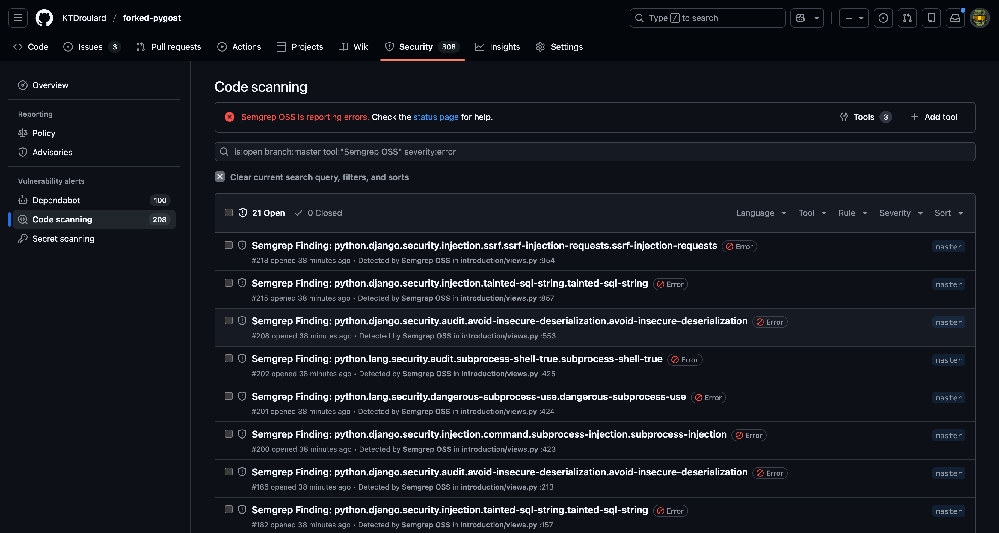
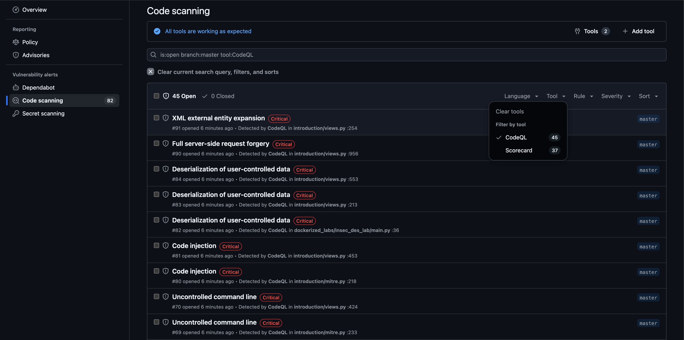
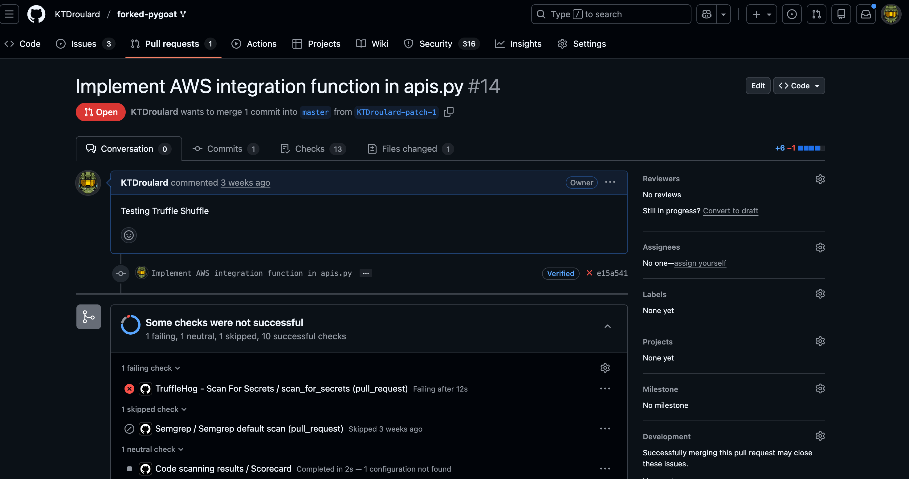
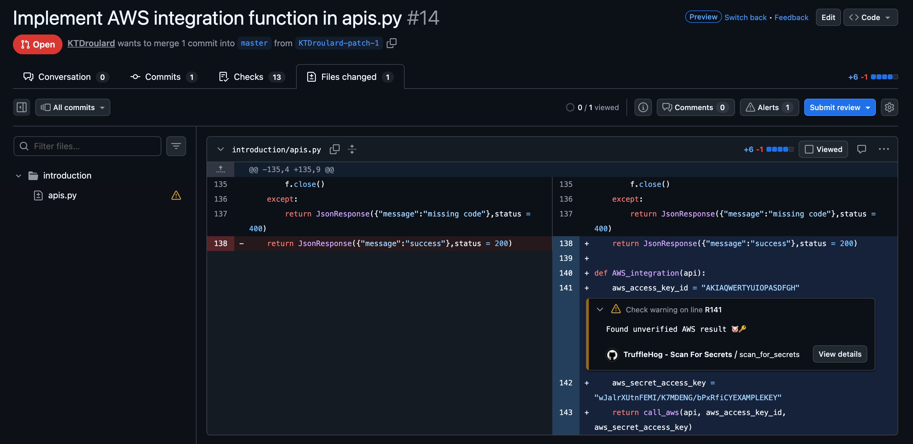
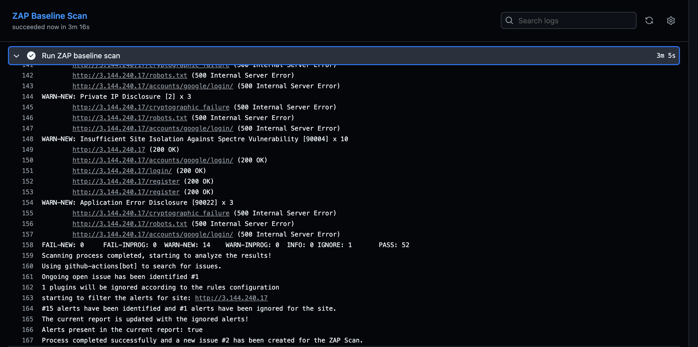
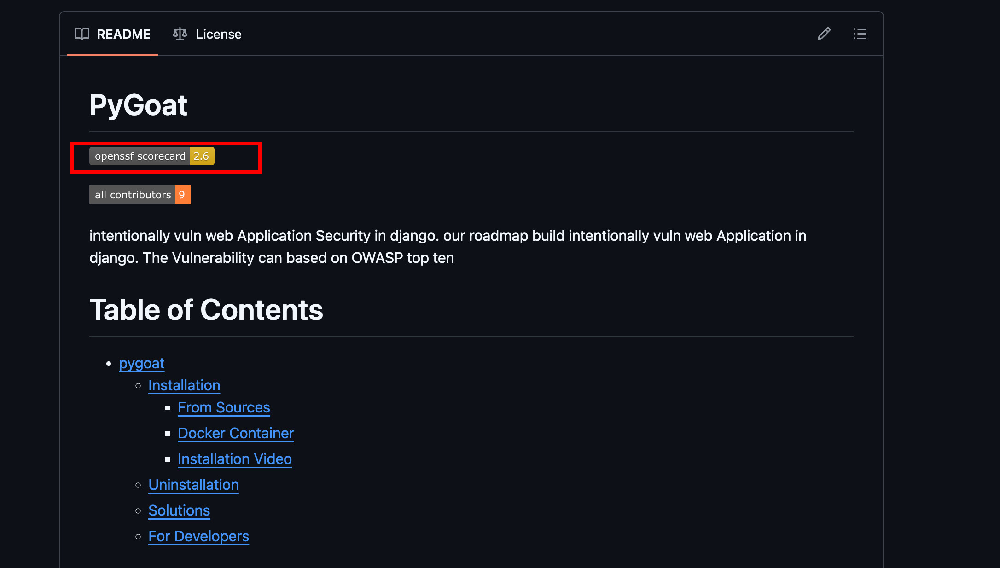
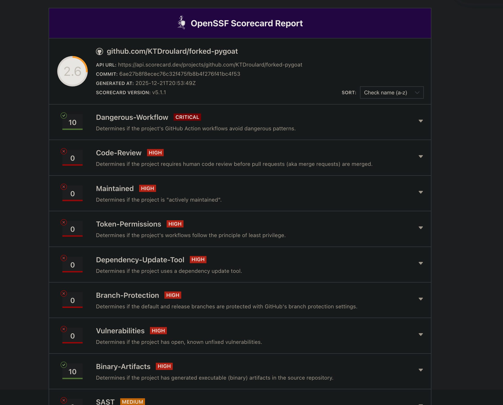
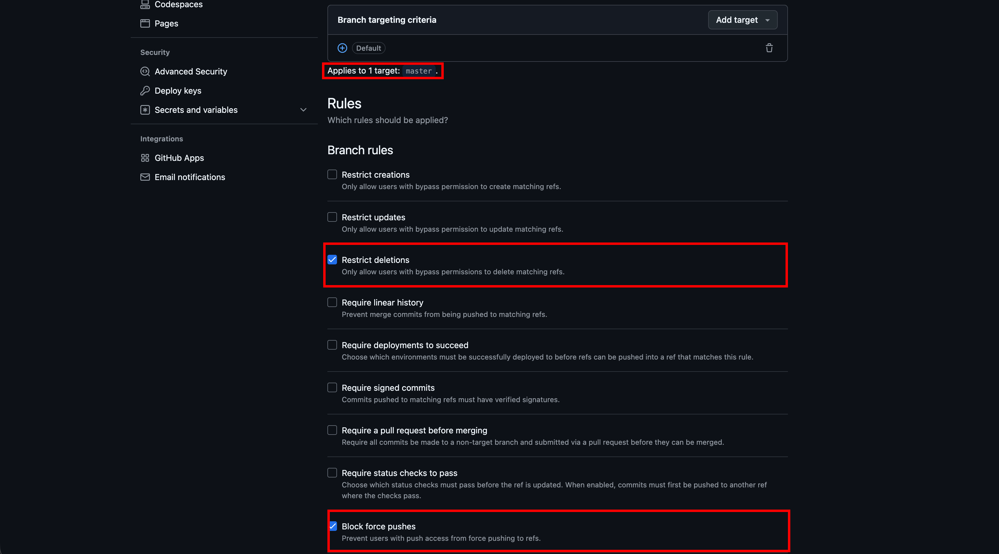
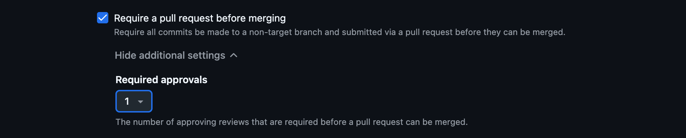

# Forked PyGoat - Pipeline Security Demonstration

PyGoat is a vulnerable Web Application built in Django to demonstrate common vulnerabilities. This forked project uses GitHub Actions to demonstrate Pipeline Security and branch protection rules to demonstrate code quality control.

## GitHub Workflows For Security

GitHub Workflows enable security checks within development pipelines, providing the ability to validate code and detect security flaws early in the SDLC. With proper checks in place, you can build security gates that prevent vulnerabilities before deployment. Workflows can trigger on commits, PRs, or scheduled scans for regular automated checks.

### SAST Testing

Static Application Security Testing (SAST) detects vulnerable patterns within code, finding issues like SQL Injection, XSS, CSRF, and many other vulnerability types.

- **CodeQL**: Comprehensive analysis but slower execution
- **Semgrep**: Pattern-based detection supporting custom rules written in YAML. Much faster than standard tests due to focused, less comprehensive scanning. Custom rulesets enable checking for specific business logic vulnerabilities.

**Workflows**: 
- [Semgrep](https://github.com/KTDroulard/forked-pygoat/blob/master/.github/workflows/semgrep.yml)
- [CodeQL](https://github.com/KTDroulard/forked-pygoat/blob/master/.github/workflows/codeql.yml)

### Secret Scanning

Secret Scanning detects secrets accidentally deployed in code changes. In this example, TruffleHog is used to detect a fake AWS credential pushed into a PR.

**Workflow**: [TruffleHog](https://github.com/KTDroulard/forked-pygoat/blob/master/.github/workflows/TruffleHog.yaml)

### DAST Testing

DAST testing is powered by ZAP, which offers multiple scan types including Baseline, Full Scans, and API Scans. You can even run authenticated scans by creating a context and storing it within a folder like .zap. The Baseline Scan is used in these workflows because it's time-limited and can report on issues passively. 

**Resources**: [ZAP Scans Documentation](https://www.zaproxy.org/docs/docker/) 

**Workflow**: [Zap Baseline Scan](https://github.com/KTDroulard/forked-pygoat/blob/master/.github/workflows/DAST-baseline.yaml)

### Dependency SBOMS
An SBOM is a nested inventory, a list of ingredients that make up software components.

**Resources**: [CISA SBOM Information](https://www.cisa.gov/sbom) | [Example SBOM](https://github.com/KTDroulard/forked-pygoat/blob/master/sbom.cdx.json)

**Workflow**: [Cyclone SBOM](https://github.com/KTDroulard/forked-pygoat/blob/master/.github/workflows/CycloneDX-SBOM.yml) 

### OpenSSF Scorecard

Scorecard is an automated tool that assesses important heuristics ("checks") associated with software security and assigns each check a score of 0-10. You can use these scores to understand specific areas to improve in order to strengthen the security posture of your project. You can also assess the risks that dependencies introduce, and make informed decisions about accepting these risks, evaluating alternative solutions, or working with maintainers to make improvements.

**Resources**: [OpenSSF Scorecard](https://github.com/ossf/scorecard) | [Workflow](https://github.com/KTDroulard/forked-pygoat/blob/master/.github/workflows/scorecard.yml)

## Branch Protection

GitHub Branch Protection Rules allow you to set requirements that deployments must succeed before merging, require signed commits, require pull requests before merging, and require specific status checks to succeed before accepting commits.

**Original PyGaot Docs:** [PyGoat Docs](https://github.com/KTDroulard/forked-pygoat/blob/master/docs/og-pygoat-docs.md)